CNN model weights: https://drive.google.com/open?id=1lpZv1X0G8h0aGKTcKUC9UCq_o56nLL3H  

Overview:

The objective of this project was to learn and experiment with Convolutional Neural Networks (CNNs) in the context of detecting and recognizing housing numbers from complex image scenes. Given an image, the task is to identify the number, or number sequence. This report details the tools, strategies, experiments, challenges and results seen while implementing my solution, as well as highlighting potential improvements to my pipeline, and discussing the latest published work. 

Published Work and State of the Art:

Detecting ad reading text from natural images is a hard computer vision task that is important to many new applications. Seemingly similar tasks, like recognizing hand written digits, or ImageNet-style object recognition have seen huge successes with CNNs, and state-of-the-art systems are considered at or above human-level performance. However, reliably recognizing characters in more complex scenes is far more difficult and lags far behind human-level performance – which is considered to be about 98% accuracy for this task. Specifically, for the task of multi-digit number recognition from street view imagery, a 2013 paper by Goodfellow, et al. established state of the art performance – achieving 96% accuracy on recognizing complete street numbers in the Stanford Street View House Number (SVHN) dataset {2}. On per-digit recognition task, the paper reported 97.84% accuracy – also state of the art. Additionally, the team applied their system to reCAPTCHA, a widely used reverse turing test to distinguish humans from bots. They reported 99.8% accuracy on the hardest category of reCAPTCHA images – performance comparable to and, in some cases, exceeding human performance. The key to their success was focusing on recognizing the sequence of digits all at once, rather than individual digit recognition.

Other papers have tackled this challenge of reading digits in natural images with the SVHN dataset. Netzer, Wang, et al, attempted to solve this challenge with unsupervised feature learning – HOG, Binary Features, K-Means, Stacked Sparse Auto-Encoders {2}. Of course, these are completely different approaches than CNN model discussed in Goodfellow’s paper, and the system is not as performant.

Pipeline:

At a high level, my strategy for this challenge was to use a sliding window technique over the input image, a CNN trained to recognize single digits, and non-maxima suppression + other “post-detection” processes to eliminate false positives and duplicate detections. Each section of this pipeline introduced challenges and much experimentation remains to improve the overall performance. 

a.	Data Collection

The SVHN dataset {1} is a real-world image dataset obtained from house numbers in Google Street View images. There are over 600,000 labeled digit images. For my purposes, the classes in this dataset (digits 0-9) needs to be augmented with an additional class: “not-digit”. This is because my sliding window technique with attempt to classify areas of an image that do not contain a digit, and therefore there needs to be an 11th class representing the absence of a digit. To create the classes of this dataset, I took the SVHN dataset in “format 1” (see below) and cropped regions of the image that don’t include digits. For each image, the red square represents the sub image collected for use as a “non-digit” class. I then took the “format 2” (images centered on individual digits) as my 0-9 digit classes. Below is a sample of the resulting combined dataset. Each image is 32x32 pixels. Note: non-digit class is labeled as ‘10’:

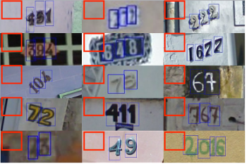 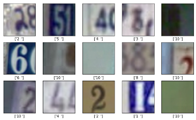
     

The following is the breakdown of how many image-label pairs were split into training / validation / testing:
Training: 424,639 
Validation: 181,989
Testing: 259,984

Below is the class distribution for this combined dataset:
 
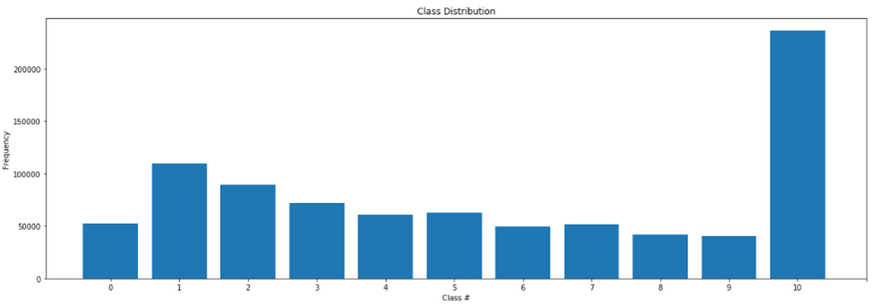

b.	CNN Architecture

The digit detection / classification comes from the CNN – a variant of deep neural networks that take advantage of the hierarchical nature of objects to perform object classification.  The majority of the effort in this project went into learning about neural networks, deep learning in general, and convolutional neural networks. The fundamentals of this subfield of machine learning has been around for some, but only in the last 10 years has it seen huge growth in popularity, performance, and applications. Many researchers in the field identify 3 causes for this recent boom in deep learning: the availability of powerful GPUs used for training, the availability of large public datasets necessary to train deeper architectures, and algorithmic advancements. I implemented my architecture in Keras, a high-level neural networks API, written in python, and capable of running on top of TensorFlow – an open source machine learning framework developed by Google. 

Model Layers
CNNs differ from other deep learning architectures by the model layers. Convolutional layers take advantage of local structure and can learn hierarchical patterns and shapes, which makes them ideal for use on images. Starting with the original image as input, spatial information is slowly squeezed out, and only information about the content remains. For each convolutional layer, the depth of the output increases, and this corresponds to the semantic complexity of the image. Another layer often used in CNNs is the Max pooling layer. These are often alternated between convolutional layers and are used to reduce the size of the input and allow the network to focus on the most important elements. Dropout layers are often used during training to encourage redundant representations within the network. They work by randomly zero-ing out some percentage of the actuations between layers so that the network learns to represent important features more than one time. Finally, dense, or fully connected, layers are added after convolution and pooling layers to further learn complex representations and reduce the network output to the number of classes for the given task. 

For each of these layers, many different parameters can be set where applicable. These include activation function on feed forward layers, dropout rate, and convolutional filter size, stride, depth. These are all parameters that must be experimented with and tuned to find the best performance. 

In this project, I experimented with 3 architectures: 
1.	Custom 
2.	VGG16 trained from scratch
3.	VGG16 with pretrained weights
Each architecture was trained, validated, and tested against the same data, used the same Keras ImageDataGenerator, and used the same loss function and the same optimizer. 

The Keras ImageDataGenerator generates batches of tensor image data from local file structures with the images split into the appropriate classes. The generator is also capable of real-time data augmentation, which allows the training data to be normalized, rescaled, brightened, shifted, sheared, rotated, zoomed, etc. These training set modifications allow the network to become more robust to brightness and pose variations. Adjusting each image such that it has 0 mean and equal variance allows the network optimizer to find a better solution. A badly conditioned problem means that the optimizer has to do a lot of searching to find a good solution, and this is difficult in very high dimensional spaces such as images. 

The loss function used by the 3 architectures was “categorical_crossentropy”. The last fully-connected layer of each network architecture is activated by a softmax function. The softmax function turns logits into probabilities for each class such that the probability of the correct class is close to 1.0. Then, the cross-entropy loss function answers how likely it is that an event happens based on the probability. It is the sum of the negative of the natural logs of the model probabilities. The negative of the log can be thought of as errors at each point. Thus, large log values mean high errors, and so low cross entropy is better. This allows us to use cross entropy as the error function – and the goal of the network is to minimize it via gradient descent.

Other parameters of each CNN model include number of epochs, batch size, learning rate, learning rate decay, and knowing when to stop training. These are the so-called “black magic” hyperparameters of deep learning. This name comes from the fact that there are no precise rules or laws to follow when tuning these parameters for any given dataset and model architecture. I manually experimented with many values of these parameters, starting with the default values that Keras provides. Learning rate is the parameter that controls how much the algorithm adjusts the weights of the network with respect to the loss gradient. By trying different values of learning rate, I discovered that a lower learning of 0.0001 (down from the default of 0.001) performed better for the two VGG16 networks. However, my smaller custom network did not see any improvement from the lower learning rate. Batch size defines the number of samples that will be fed to the network before the network updates the weights. The smaller the batch size, the less accurate the gradient will be, but this is typically offset by faster descent. Batch size was also manually tuned, trying larger and smaller batch sizes. Larger batch sizes tended to reduce accuracy, and I found batch_size=32 to work well. The number of epochs is also an important consideration. After training the model, plotting the training and validation accuracies can reveal how quickly the network is learning, and when it begins to plateau. I found 20 epochs to be a suitable amount of time for the network to gain high accuracy with very limited improvement for more training epochs. Over-training can lead to over fitting and worse testing and validation accuracies. 

i.	Custom architecture
a.	64x64x3 input shape
b.	4 Convolutional layers, each with 3x3 filters and increasing depth, with ‘relu’ activations
c.	4 MaxPooling layers placed in between each convolutional layer with 2x2 pool size
d.	Flatten layer
e.	Dropout layer (during training)
f.	3 Fully Connected layers with 2 relu activations, and a softmax activation
g.	Learning rate = 0.001
ii.	VGG16 trained from scratch
a.	Used Keras’ VGG16 application with randomly initialized weights as the convolutional base
b.	After the base, I included Flatten layer and 2 fully connected layers
c.	Note: the default learning rate for the Adam optimizer was too high for this model to converge. A lower learning rate of 0.0001 was need to achieve reasonable results. Otherwise, the model was plateauing at 28% accuracy.
iii.	VGG16 with pretrained weights
a.	Used Keras’ VGG16 application with ‘imagenet’ weights as the convolutional base. The imagenet weights were set to not trainable. 
b.	ImageNet is a popular CV competition and dataset that has is widely used as a generic measure of performance for object classification. As mentioned previously, because of the hierarchical nature of convolutional networks, lower level weights in the architecture are essentially simple edge and simple shape detectors. This is a perfect foundation on which to build a network to detect more complicated shapes like the digits in this task. 
c.	After the base, I included Flatten layer and 2 fully connected layers

Sliding Window and Post-Detection Processing:

The central challenge of the pipeline is making this system robust to scale, location in the image, font, pose, lighting, and image noise. My pipeline addresses each of these concerns, and other challenges, with the following methods (in order of the pipeline):

1.	Bilateral Filtering
An image smoothing technique used to reduce image noise. Importantly, I noticed smoothing the image reduced the number of false positive digit detections, especially in areas with small, complex shapes like the leaves of trees / bushes
2.	Pixel Scaling and Image Normalization
Normalization is achieved by subtracting the dataset pixel mean from each image. This is an important step that ensures each pixel has a similar data distribution. Pixel scaling converts the pixel values from 0-255 to the range 0-1. Neural networks work with numbers in the 0-1 range better than 0-255
3.	Sliding Window Search 
A multi-scale window search over each input image allows the system to detect multiple digits seen at different scales and different locations within the image. For each window, the most performant CNN model (VGG16 w/ pretrained imagenet weights) is used to classify as digit 0-9 or non-digit. The probability threshold for a positive detection was 99.5%. 
To address slow performance issues with the sliding window search when processing video, I implemented a narrowed search algorithm to mitigate the forward pass runtime on videos. Once a detection has been made, the pipeline will only search a limited area around that detection in the next frame. Then, once every 20 frames, the pipeline will do a full image search
4.	Per-Class Non-Maxima Suppression
The digit detections of the sliding window method often occur within multiple windows, either at different scales or different window positions. As a result, a single digit has multiple bounding boxes. Non-maxima suppression solves this problem by organizing the detections into the most confident predictions given by the CNN model. Starting with the most confident detection, the algorithm removes other detections that have an overlapping bounding box with some threshold. I made a slight adjustment to this general algorithm, and performed non-maxima suppression for each class. The resolves the issue of adjacent digits suppressing each other’s detections. 
5.	Concentric detection removal
Because I performed non-maxima suppression on a per class basis, an issue arose that digits were being detected within other digit classes, but not being suppressed. In particular, 0’s were often detected at the “o” portion of 6’s, 8’s and 9’s. To account for this, I suppressed all detections that were fully within the bounding box of another detection. This worked well and solved the issue.

CNN Performance:
As the following table demonstrates, the VGG model pretrained with imagenet weights was the most performant, as measured by test set accuracy. This is not a surprise, as the imagenet weights are a solid foundation of simple edge and shape detection on which my fully connected layers can be trained for the task of digit recognition. It is important to note that because I have augmented this dataset with “non-digit” images, this performance is not appropriately compared to networks that were trained purely on the SVHN dataset – such as the previously mentioned state-of-the-art network from the Goodfellow paper.

Architecture	Training Accuracy	Validation Accuracy	Testing Accuracy
Custom	87.39%	94.37%	93.87%
VGG random weights	96.59%	96.25%	96.62%
VGG imagenet weights	97.65%	98.31%	97.93%

Below is the training and validation accuracy / loss over 20 epochs of training. 

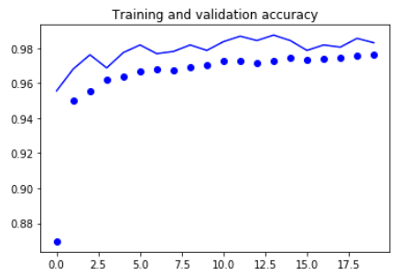 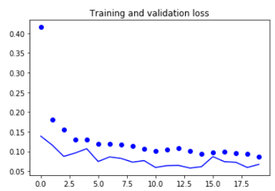

Pipeline performance:
The overall performance of the pipeline is hard to compare against public data, given that pipeline runs relatively slowly compared to the CNN model classifier by itself and is therefore hard to run large tests and analyze statistically. Instead of a public dataset, I have collected sample images and sample videos and have evaluated my entire pipeline on these images. The performance of the pipeline is good, though some missed detections occur, and some false detections remain. The two main challenges of the pipeline implementation were optimizing for runtime, and removing false positive detections. As discussed previously, to address these concerns I have smoothed the images, implemented a per-class non-maxima suppression algorithm, and an additional algorithm the removes detection that are fully contained within other detections. The result is a system that performs well, though leaves much room for improvement. 

Example results from pipeline (note: these are images 1-4 that run.py generates)  
  
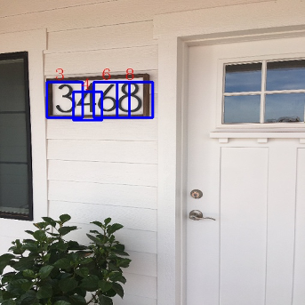 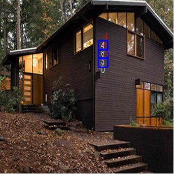

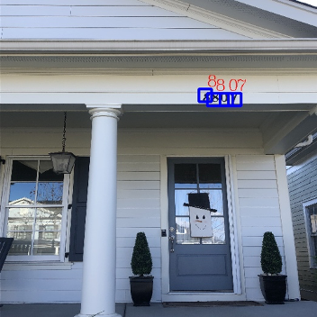 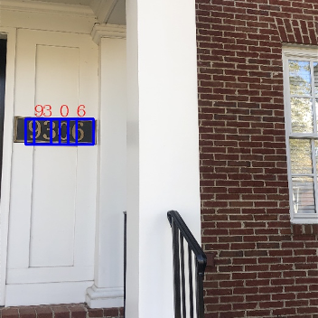

The most notable failures with this pipeline are the false detections. There are some cases where there is genuine ambiguity as to whether the image contains a digit. Ambiguity such that, without the surrounding image context, it could very easily fool a human as well. This issue is part of what makes this task so difficult. False detections on ‘1s’ were particularly tricky, and because of the abundance of straight vertical edges that can easily be confused for “1”. In other cases, a human could easily tell the image window is not a digit, but it is understandable how the computer is fooled by the vague look-a-like. False detection examples below in order – 2, 7, 7:

 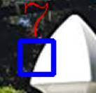 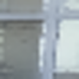

Discussion and Improvements:
For the cases where the pipeline is fooled by a look-a-like, more training data would be needed. Indeed, it would be wise to actually take some of these digit look-a-likes that the network has falsely detected and add them to the non-digit class. To collect such a look-a-like dataset, I could set the detection confidence minimum threshold to 0%, and maximum confidence threshold to 60%, and run the pipeline on videos and images. This would yield images that were not confidently classified as digits, though probably look like digits. Training on these non-digit images would make the pipeline more robust.

There are many modifications to the CNN that could improve performance. In general, more CNN architecture tuning and more hyperparameter tuning on existing models could yield better detection accuracy. Additionally, I could attempt to implement what Goodfellow paper describes – classifying the entire digit sequence instead of individual digits. One interesting note is that full sequence classification may not be robust to vertical number orientations. 

One modification of the pipeline that could help with false detections is to only accept detections that have occurred on multiple window scales. I considered this addition, but ultimately rejected it because many digits were only detected at 1 window scale. But I could try adding more scales in hopes of getting the digits detected more often. 

References and Citations:
1: SVHN Dataset: http://ufldl.stanford.edu/housenumbers/ 
2: Multi-digit Number Recognition from Street View Imagery using Deep Convolutional Neural Networks. Goodfellow, Bulatov, Ibarz, Shet. 14 April  2014 https://arxiv.org/abs/1312.6082 
3: Reading Digits in Natural Images with Unsupervised Feature Learning. Netzer, Wang, et al.  http://ufldl.stanford.edu/housenumbers/nips2011_housenumbers.pdf 
4: Deep Learning with Python. Francois Chollet. 2017
